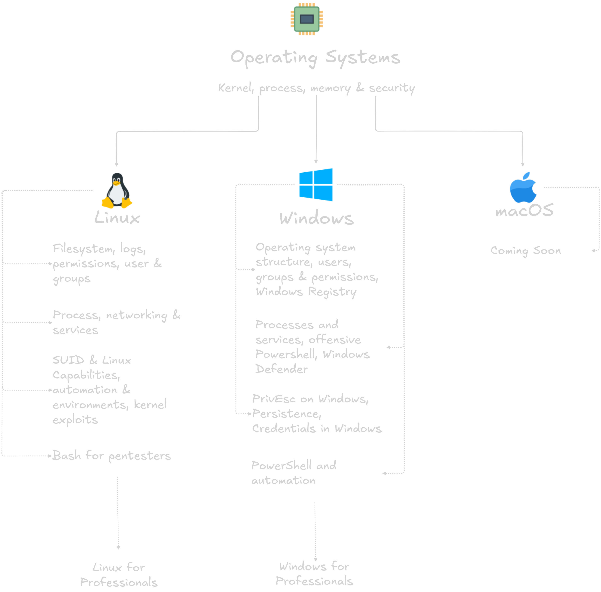

  
  <h1>Learning Path OS for Red Teamers</h1>

  

# 📚 Table

- [What is this](#what-is-this-)
- [Operating System](#operating-system)
  - [First Block](#first-block--kernel--border)
  - [Second Block](#second-block--processes-and-memory)
  - [Third Block](#third-block--os-security-and-trust-model)
- [Linux](#linux)
  - [First Block](#first-block--system)
  - [Second Block](#second-block--machine)
  - [Third Block](#third-block--vulnerabilities-and-escalation-of-privileges)
  - [Fourth Block](#fourth-block--bash)
  - [Relevant Block](#relevan-block-linux)
- [Windows](#windows)
  - [First Block]()
  - [Second Block]()
  - [Third Block]()
  - [Fourth Block]()

  

# What is this? 👀

Back then in my script-kiddie era, I had a lot of doubts about what to understand and what not to understand, what to practice and what not to practice. This led me to questions like: "What is a system call?", "I've already logged into the system, but how do I get root privileges if `sudo -l` doesn't work?", "How do I create a bash shell?", and "How is it possible that there are people so crazy that they find vulnerabilities in a security-focused distribution, and I don't even know how to create an alias?"

Thanks to my perseverance (I didn't understand anything I read) in questioning the "why" of everything, and to my extensive experience, I decided to create this learning path, and others you can find [here](https://github.com/capitan-grizzly), dedicated to operating systems that go beyond simply reading.

In security, everything is important. Don't become an expert if you don't want to be one, but try to learn the fundamentals and what's relevant. And a word of advice: if you understood it the first time, you didn't understand anything.

PD: No te preocupes por no saber inglés, traducir es bueno pero intenta poner un poquito de empeño en aprenderlo.

**So, what are you waiting for to get started?**
  

# Operating System

> The **_Relevant Modules_** are only taken when the topic/technique has been explored in sufficient depth and versatility has been demonstrated.

### First Block — Kernel & Border

- **Kernel context:** What is a kernel, user space vs. kernel space, syscalls, how a program requests something from the OS. — Use strace in Linux to see the syscalls made by a simple command (ls, cat). Document what each syscall you see is requesting from the kernel..
- **Getting to know the CPU:** Interrupts, context switching, scheduling, what happens when the CPU switches processes. — Create two Python processes that run in parallel. Observe how the kernel manages them using htop and /proc. Explain what would happen if one process refused to relinquish the CPU.

> **Evaluation**  
> Find a privilege escalation CVE via syscall or kernel exploit from the last year. Read about it and write down what boundary it crossed and why the kernel allowed it.

### Second Block — Processes and memory

- **Process lifecycle:** fork, exec, exit — how a process is created in Linux and Windows, what it inherits from its parent, and the difference between a thread and a process. — Write a Python program that creates child processes, shares memory with them, and terminates them. Observe the memory usage of each child process in **`/proc/[pid]/maps`**.
- **Memory management:** stack vs. heap, virtual memory, segmentation, and why it matters for buffer overflows and memory exploits. — Write a C program with a fixed-size buffer. Observe what happens when it overflows.

> **Evaluation**  
> Compare how Linux and Windows create a new process. Diagram the flow of each and indicate at what point an attacker could intervene in each OS.

### Third Block — OS security and trust model

**Capitan Note:** _I recommend going through this module only if you already have a solid foundation in security and operating system knowledge._

So, check your [Linux](#linux) or [Windows](#windows) PATH environment variable before starting this module.

- **Access control models:** DAC, MAC, RBAC, how Linux and Windows implement them differently, what SELinux and UAC are at the model level. — Enable SELinux in a Linux VM in permissive mode. Observe what it denies when performing the same actions as before. Document what changed and why.
- **System boot:** BIOS/UEFI, bootloader, init/systemd vs. Windows Boot Manager, what happens before the login screen, and why it matters for persistence and bootkits — Document the complete boot process of Linux and Windows VMs. Indicate at what stage each persistence mechanism is involved.
  > **Evaluation**  
  > Take an attack you already master (a Linux PrivEsc, a Windows one, and a web vulnerability) and write for each one what layer of the OS it occurs at, what component of the kernel or security model fails, and what would have to change in the OS to make it impossible.

### Relevant Block

- **Modern Kernel Exploits —** Dirty Pipe, Dirty COW
- **Bootkits and UEFI Malware —** Persistence Deeper Than Any Cron Job
- **Containers and Namespaces —** Docker Uses Linux Kernel Namespaces — Container Escape Starts Here
- **Hypervisors and VM Escape —** The Deepest Frontier of Modern Red Teaming

# Linux

> The **_Relevant Modules_** are only taken when the topic/technique has been explored in sufficient depth and versatility has been demonstrated.

### First Block — System

- **File System:** FHS hierarchy, inodes, hard/soft links &rarr; Explore `/etc`, `/proc`, and `/var` and describe (or describe to a friend) in your own words what each is used for.
- **Kernel & Logs:** `uname`, `lsmod`, `modprobe` &rarr; Understand how software interacts with hardware. Analyze `/var/log/auth.log` and `/var/log/syslog`.
- **Permissions:** rwx, octal, `chmod`, `chown`, `umask` &rarr; Create 3 dummy users and assign specific permissions to files and directories.
- **Users and groups:** `/etc/passwd`, `/etc/shadow`, `sudo`, `su`. — Create users, assign groups, restrict access. Break your own system and fix it.

> **Evaluation**  
> You are given a system with incorrectly configured permissions and faulty access controls. [Run this exam script](./scripts_evaluations_PathOS/Linux_firstblock_lab.sh) within a clean VM to set up the environment. Identify all problems, correct them, and submit a report explaining each one.

### Second Block — Machine

- **Processes:** `ps`, `top`, signals, `kill`, `foreground`/`background` — Monitor a system in real time. Explain each column of `ps aux` without searching.
- **Networking & Storage:** `ip a`, `ss -tulpn`, `/etc/resolv.conf`, `df -h`, `du -sh`, `mount` — Troubleshoot network connectivity, identify open ports, and manage disk space. [Run the network configuration script](./scripts_evaluations_PathOS/Linux_network_lab.sh)
- **Services and systemd:** `systemctl`, `units`, `targets`, `journalctl` — Install nginx or SSH, configure it, disable it, and analyze its logs.
- **Config files:** `sshd_config`, `sudoers`, `crontab`, `hosts` — Modify each one with a specific purpose. Document what you changed and why.

  Environment Personalization (Dotfiles):
  - [Oh my Posh](https://ohmyposh.dev/) &rarr; For an advanced terminal framework.
  - [oh my zsh!](https://ohmyz.sh/) &rarr; for an advanced terminal framework.
  - Upgrade standard Unix utilities with modern tools: [zoxide](https://rockstardeveloperuniversity.com/best-terminal-cli-tools/) for navigation, [fzf](https://rockstardeveloperuniversity.com/best-terminal-cli-tools/) for history searches, and [bat](https://rockstardeveloperuniversity.com/best-terminal-cli-tools/) for viewing configs.
  - Personal recommendation: Take a look at the **aliases** and learn more about how to set up your ethical hacking environment

> **Evaluation**  
> Install a clean Debian/Ubuntu VM with or without a GUI. Establish SSH access, change its default port, create a user with restricted sudo privileges, configure a cron job, and verify network and storage health. Submit a report.

### Third Block — Vulnerabilities and Escalation of Privileges

- **SUID, SGID, Sticky Bit, capabilities** — what they are and how they can be abused. — Find all SUID binaries in a VM. Investigate 3 in GTFOBins. [Run the misconfiguration script](./scripts_evaluations_PathOS/Linux_misconfiguration_lab.sh)
- **Automation and environments:** Cron jobs, relative paths, environment variables as vectors — Intentionally create a vulnerable cron job and exploit the path. Document the process.
- **Misconfigurations & Cleartext Passwords:** misconfigured sudoers, dangerous wildcards, scripts with excessive permissions. — Replicate three PrivEsc scenarios from GTFOBins. Use `grep` to hunt for exposed credentials in `/var/www/` or `/opt/`. [Run the misconfiguration script](./scripts_evaluations_PathOS/Linux_misconfigurationTwo_lab.sh)
- **Kernel Exploits:** Local PrivEsc concepts based on `uname -r` — Learn how to identify out-of-date kernels and match them with known public exploits securely.
  > **Evaluation**  
  > A VM with 5 hidden PrivEsc vectors (including a custom SUID, a path hijacking, a bad sudoers rule, and a hidden credential). Find them all, exploit them, and deliver a report with: vector found — why it exists — how it was exploited — how to patch it. [Run this exam script](./scripts_evaluations_PathOS/Linux_thirdblock_lab.sh)

### Fourth Block — Bash

- **First Steps:** Variables, conditionals, loops, functions, redirection, pipes. — Rewrite 5 manually executed commands as reusable scripts
- **Text Processing:** `grep`, `awk`, `sed`, `cut` — Parse and filter complex command outputs, log files, and tool results efficiently.
- **Bash for Red Teamers:** Offensive scripts: enumerate users, look up SUIDs, check cron jobs, list ports. — Write a post-exploitation enumeration script that runs on any Linux distribution. Validate it using `shellcheck`.
  > **Evaluation:**
  >
  > - 2 OverTheWire Bandit machines (levels 20–30) with no write-ups in the first hour
  > - 1 THM or HTB Linux-focused machine using PrivEsc
  > - Full, professionally formatted report for one of them

### Relevan Block Linux

- **Containers & Docker:** Container escape concepts, exposed Docker sockets, and poorly configured container images.
- **Persistence Mechanisms:** Creating backdoors via malicious `systemd` services, automated `cron` tasks, or modified `.bashrc` profiles.
- **Automated Auditing (Hardening vs. Enumeration):** Run `LinPeas` or `Lynis` on your lab VMs to compare manual findings against automated security reports.

# Windows

> The **_Relevant Modules_** are only taken when the topic/technique has been explored in sufficient depth and versatility has been demonstrated.

### First Block —

- **Operating system structure**: NTFS file system, directory classification, paths, environment variables, cmd vs. PowerShell. → Explore C:\Windows\System32, C:\Users, and C:\Program Files. Describe the purpose of each.
- **NTFS Users, Groups, and Permissions**: ACLs, Inheritance, icacls, Differences from the Unix Model. → Create three local users and assign specific permissions to files and folders using icacls. Intentionally break access and fix it.
- **Windows Registry**: Structure (hives), key information for a Red Teamer, and how to read and modify it from the command line. → Identify registry keys related to autorun, services, and stored credentials. Document each key and what it exposes.
  > **Evaluation:**  
  > You are given a system with incorrectly configured permissions and broken access controls. Identify all the problems, correct them, and submit a report explaining each one.
  > [Run this exam script](./scripts_evaluations_PathOS/Win_FirstBlock.ps1)

### Second Block — Machine

- **Processes and services:** Task Manager from the CLI, tasklist, sc, Get-Process, how a service is installed and persisted. → Enumerate all services on a VM. Identify which ones run with elevated privileges. Explain what would happen if you could modify the binary of one.
- **Offensive PowerShell:** execution policies, bypass, useful cmdlets for enumeration, pipelines, basic remoting. → Write a PowerShell script that enumerates users, groups, services, open ports, and autorun keys. No external tools required.
- **Windows Defender and basic defense mechanisms**: what it detects, how AMSI works, what UAC is, and why it matters. → Analyze what Defender detects on your VM. Document which basic enumeration techniques it blocks and which it doesn't.

> **Evaluation**  
>  Install a clean Windows VM. Configure a vulnerable service, a user with excessive permissions, and a malicious autorun key. Then switch roles—find everything from scratch and document it as if it were a pentest report. [Run this exam script](./scripts_evaluations_PathOS/Win_SecondtBlock.ps1)

### Third Block — Windows for Pentesters

- **PrivEsc on Windows:** Services with weak permissions, unquoted service paths, token impersonation, Always Install Elevated. &rarr; Find the four vectors in a VM using manual enumeration first. Then verify with WinPEAS. Document the differences between what you found manually and what the tool found. [Run this privesc simulation script](./scripts_evaluations_PathOS/Win_privesc.ps1)
- **Persistence:** Scheduled tasks, malicious services, registry (Run/RunOnce), startup folders, basic DLL hijacking. &rarr; Implement four different persistence mechanisms in a VM. Reboot and verify that they survive. Document how a blue teamer would detect them.
- **Credentials in Windows:** SAM, LSASS, plaintext credentials, session tokens—how they are stored and how they are extracted. &rarr; Extract hashes from SAM in a lab with admin access. Document what they are, how they are generated, and what can be done with them.

> **Evaluation**  
> Windows VM with five PrivEsc vectors and three persistence mechanisms implemented. Find them all, document how to exploit them, how to persist after exploiting them, and how the blue team would detect them. [Run this exam script](./scripts_evaluations_PathOS/Win_ThirdBlock.ps1)

### Fourth Block — PowerShell and automation

- **PowerShell as a complete offensive tool:** download and execute in memory, interact with the registry, manage processes and services, and enumerate the basic domain. &rarr; Rewrite the enumeration script from point 5 with additional capabilities: extract users from the domain if it exists, find credentials in common files, and report any PrivEsc vectors found.

> **Evaluation:**
>
> - Resolve two HTB or THL machines running Windows with a local PrivEsc vector.
> - One of these must involve documented persistence.
> - Deliver a complete, professionally formatted report including: initial access, escalation, persistence, impact, and remediation.

### Relevant Block

- **BloodHound / SharpHound →** AD Mapping.
- **AMSI Bypass and AV Evasion →** Standard defense on any modern Windows system.
- **Credential Guard and Protected Users →** Modern Windows mitigations that change how credentials are stolen.
- **Basic EDR** → what it is, what telemetry it captures.
- **Living Off The Land (LOLBAS) →** A core technique of the modern Red Team.

  

# 🌐 Resource for Paths

### Operating Systems

| Books                                                      | Documentation                                                                                                   |
| :--------------------------------------------------------- | :-------------------------------------------------------------------------------------------------------------- |
| **Operating Systems: Three Easy Pieces** — Arpaci-Dusseau. | [ostep.org](https://pages.cs.wisc.edu/~remzi/OSTEP/) — Operating Systems: Three Easy Pieces (free and complete) |
| **Modern Operating Systems** — Tanenbaum.                  | [kernel.org](https://www.kernel.org/) — Linux kernel documentation                                              |
| **Windows Internals** — Russinovich.                       | man 2 (syscall) — manual for each syscall in Linux directly in your terminal                                    |

### Linux

| Books                                       | Documentation                                                                                                                            |
| :------------------------------------------ | :--------------------------------------------------------------------------------------------------------------------------------------- |
| **The Linux Command Line** — William Shotts | `man [command]` — before Google, always.                                                                                                 |
| **Linux Basics for Hackers** — OccupyTheWeb | [Arch Wiki](https://wiki.archlinux.org/title/Main_page) or another Wiki — The best Linux documentation out there, applies to any distro. |
| **How Linux Works** — Brian Ward            | [GNU Coreutils](gnu.org/software/coreutils/manual)                                                                                       |

 

**Platforms**

- OverTheWire: Bandit — Main plugin (CLI and permissions in CTF format)
- GTFOBins — Mandatory reference in Block 3
- TryHackMe — Supplement (Linux/PrivEsc rooms only)
- HTB / DockerLabs / THL — Only from the latest evaluation

### Windows

| Books                                          | Documentation                                                                                                                     |
| :--------------------------------------------- | :-------------------------------------------------------------------------------------------------------------------------------- |
| **The Hacker Playbook 3** — Peter Kim.         | [learn.microsoft.com](https://learn.microsoft.com/en-us/) -- documentation for every Windows cmdlet, service, and component.      |
| **Windows Internals** — Russinovich & Solomon. | [lolbas-project.github.io](https://lolbas-project.github.io/) — Living Off The Land Binaries for Windows (equivalent to GTFOBins) |
| **Penetration Testing** — Georgia Weidman.     | [PayloadsAllTheThings](https://github.com/swisskyrepo/PayloadsAllTheThings) — a reference for techniques by category              |

 

**Platforms**

- **TryHackMe:** Windows Fundamentals, Windows PrivEsc &rarr; Supplement for Blocks 1 and 3
- **HTB / THL:** Windows machines &rarr; Syllabus closing
- **HackTheBox Academy:** Windows Privilege Escalation &rarr; Technical reference for Block 3
- **Mimikatz:** Lesson 9 — but understanding what it does, not just running it

# Contributors

<table align="center">
  <tr>
    <td align="center">
      <a href="https://github.com/capitan-grizzly">
         
        <b>Capitan Grizzly - Creator</b>
      </a>
    </td>
  </tr>
</table>
